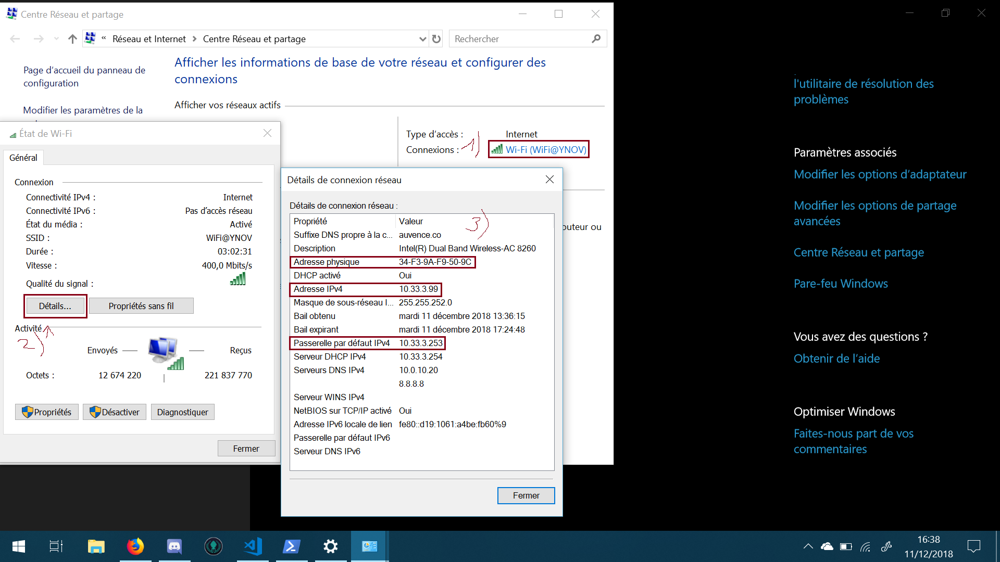

# TP Réseau

### Nom, adresse MAC et adresse IP de l'interface WiFi

```cmd
PS C:\Workspace> ipconfig /all

Configuration IP de Windows

Carte réseau sans fil Wi-Fi :

    Suffixe DNS propre à la connexion. . . : auvence.co
    Description. . . . . . . . . . . . . . : Intel(R) Dual Band Wireless-AC 8260
    Adresse physique . . . . . . . . . . . : 34-F3-9A-F9-50-9C
    DHCP activé. . . . . . . . . . . . . . : Oui
    Configuration automatique activée. . . : Oui
    Adresse IPv6 de liaison locale. . . . .: fe80::d19:1061:a4be:fb60%9(préféré)
    Adresse IPv4. . . . . . . . . . . . . .: 10.33.3.99(préféré)
    Masque de sous-réseau. . . . . . . . . : 255.255.252.0
    Bail obtenu. . . . . . . . . . . . . . : mardi 11 décembre 2018 13:36:15
    Bail expirant. . . . . . . . . . . . . : mardi 11 décembre 2018 16:49:16
    Passerelle par défaut. . . . . . . . . : 10.33.3.253
    Serveur DHCP . . . . . . . . . . . . . : 10.33.3.254
    IAID DHCPv6 . . . . . . . . . . . : 37024666
    DUID de client DHCPv6. . . . . . . . : 00-01-00-01-21-5C-3D-DA-34-F3-9A-F9-50-9C
    Serveurs DNS. . .  . . . . . . . . . . : 10.0.10.20
                                        8.8.8.8
    NetBIOS sur Tcpip. . . . . . . . . . . : Activé
```

_Adresse de réseau WiFi_ : __10.33.0.0/22__

_Adresse de broadcast_ : __10.33.3.255/22__

### Nom, adresse MAC et adresse IP de l'interface Ethernet

Je n'ai pas d'interface Ethernet

### Affichage gateway

```cmd
ipconfig /all
```

Cette commande affiche la paserelle par défaut utilisée.

### GUI

Pour afficher les informations de notre carte WiFi à l'aide de l'interface graphique il faut aller dans les _Paramètres Windows_ => _Réseaux_ => _WiFi_ => _Centre Réseaux et Partages_ et ensuite suivre les étapes sur l'image.

1. Cliquez sur la connexion voulue
2. Cliquez sur Détails
3. ???
4. Profit



### Utilité de la paserelle dans le réseau Ingésup

La paserelle du réseau Ingésup sert à relier le réseau local formé par les ordinateurs présents avec Internet.

### Calcul des premières et dernières IP du réseau

> _Adresse IPv4_ : __10.33.3.99/22__

> _Première adresse_ : __10.33.0.0/22__

>_Dernière adresse_ : __10.33.3.253/22__

```cmd
PS C:\Program Files (x86)\Nmap> .\nmap -sn -PE 10.33.0.0/22
```

J'ai choisi l'adresse IP : 10.33.2.6
